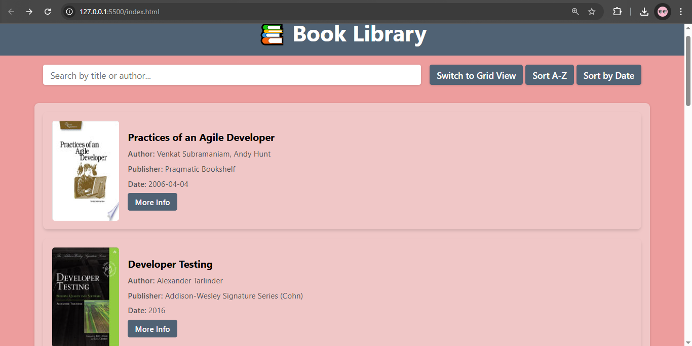
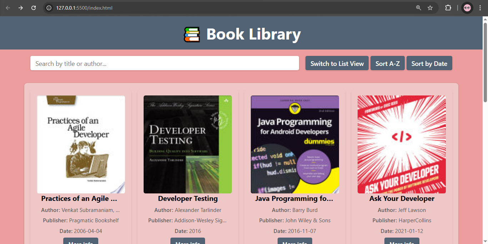

# Book Library Application

A web-based Book Library application that allows users to browse a collection of books, search by title or author, sort by different criteria, and toggle between grid and list views.

## ✨ Features
 - Search Functionality: Search books by title or author using a search bar.
 - Sorting Options: Sort books by title (A-Z, Z-A) or by publication date (oldest to newest, newest to oldest).
 - Grid and List View: Toggle between grid and list views for better display preferences.
 - Pagination: Navigate through pages of books with pagination controls (Next, Previous, and page numbers).
 - Book Details: View book information such as title, author, description, and publication date. Option to open a preview link for more details.

## 📡 API Endpoint
The application fetches Books details from the following endpoint:
GET https://api.freeapi.app/api/v1/public/books

## 📸 Screenshots
#### List View


#### Grid View


## 🚀 Deployment
You can access the live version of the application here:  
👉 [Live Host Link](https://azizul-topo.github.io/JS-04-PROJECT/)
## Technologies Used
- HTML
- CSS
- JavaScript 
- FreeAPI (Fetch API for data fetching)


## 🛠 Installation & Setup

1. Clone the repository:
```bash
git clone https://github.com/azizul-topo/JS-04-PROJECT.git
```

```bash
cd JS-04-PROJECT
```

